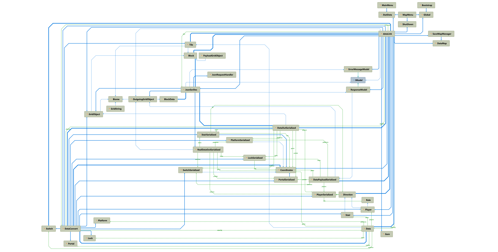

# Architecture of Project ironica

### Overview Architecture

The project is decoupled with a C/S structure. This structure allow us to decouple the project into two (or eventually more) parts that are independent to each other. Each part is concentrated by its own issues and do not influence others.

Even in the future if we will carry on the project into a standalone application, it's still preferable to implement with an embedded C/S structure rather than a monolithic application.

The communication between client and server is HTTP request with data structures in json format.

For the back-end (server) we have chosen to use Kotlin as the main language, mainly because of its strong expressiveness and flexibility of Kotlin DSL. Other libraries such as Ktor, Kotlin-serialization, KI-Shell and KotlinPoet have been used. See [the repo of Simulatte](https://github.com/Ironica/simulatte) for more information.

As for the front-end (client), we have chosen Unity3D and therefore C# as the main language. Several libraries have been used, especially the NewtonJson for Json serialization and deserialization.

### Back-end

Here's a simplified class/module diagram of implementation of back-end (without the ktor module). The overall UML will be too complicated to be shown here therefore I will move it to appendix.

Each module are loosely coupled therefore you can easily replace an implementation of one part by another implementation but the project will still work.

The first implementation (until v2) made usage of Antlr for implementing a homemade DSL interpreter along with lexer & parser generated. The second implementation (v3) switched to Kotlin DSL to take full advantage of the Kotlin language's expressiveness.

See the [wiki of Simulatte](https://github.com/Ironica/simulatte/wiki) for more info about the overall idea, the design, the implementation, and other info such as the future possibilities of the back-end.

Other informations:

-   `gradle` for project & package managements
-   `Space/GitHub` for checklist/TODO/project management

### Front-end

The front-end is implemented with Unity. It consists of several scenes:

-   a main menu scene
-   a gaming scene
-   a scene for select the map to play
-   a scene for the store

The core features stand inside the gaming scene, which is linked to the `DataLink` class. Gaming logics consist of reading user input, rendering the playground, processing the serialization/deserialization along with sending requests to server and receiving responses from server. See data flow diagram for more info.

### Misc

Here's a use-case of a server connected by two different clients, to illustrate the connections between front-end and server but also the possibility to manage multiple requests at same time.

The following diagram explains the concept of dataflow in the DataLink class.

### Appendix

-   UML Diagram for Front-End

-   UML Diagram for Back-End

    Note that this is a layout of classes in the view of Java, since PlantUML doesn't support fully the Kotlin language.

